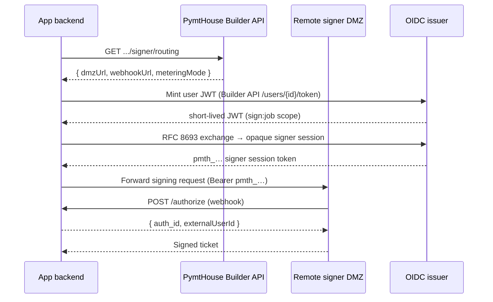
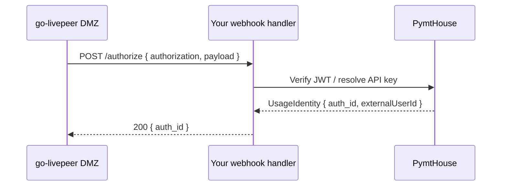

The PymtHouse hosted `/api/signer/*` HTTP proxy has been **removed** (returns `410 Gone`). Direct signer integration now uses:

1. **`GET .../signer/routing`** — fetch the DMZ URL and webhook URL for your app.
2. **`@pymthouse/builder-sdk/signer/server`** — proxy signing requests directly to the remote signer DMZ with JWT minting.
3. **`@pymthouse/builder-sdk/signer/webhook`** — handle go-livepeer identity webhook calls (`POST /authorize`) to authenticate end-users.

<Note>
  If you are migrating from the removed `/api/signer/*` proxy, see [Deprecated routes](/integration/deprecated).
</Note>

## Token lifecycle

The following diagram shows how a signing request flows from the app backend through PymtHouse to the remote signer DMZ:



---

## Fetch signer routing config

```http
GET /api/v1/apps/{clientId}/signer/routing
Authorization: Basic base64(m2m_id:m2m_secret)
```

Returns the remote DMZ URL, JWKS URL, webhook URL, and metering mode for the app.

Response:

```json
{
  "dmzUrl": "https://dmz.example.com",
  "jwksUrl": "https://your-pymthouse.example/api/v1/oidc/jwks",
  "webhookUrl": "https://your-app.example/authorize",
  "meteringMode": "kafka"
}
```

| Field | Description |
| --- | --- |
| `dmzUrl` | The remote signer DMZ base URL. Forward signing requests here. |
| `jwksUrl` | PymtHouse JWKS endpoint for the DMZ to validate JWTs. |
| `webhookUrl` | The identity webhook URL configured on the go-livepeer DMZ (`-remoteSignerWebhookUrl`). |
| `meteringMode` | `"kafka"` (async Kafka collector) or `"direct"`. |

SDK:

```ts
const routing = await client.getSignerRouting();
// routing.dmzUrl, routing.webhookUrl
```

---

## Direct DMZ proxy (`@pymthouse/builder-sdk/signer/server`)

Use `createDirectSignerProxyHandler` to build an HTTP handler in your backend that:

1. Mints a user JWT (or signer session) via the Builder API or OIDC.
2. Forwards the original signing request to the remote DMZ with the JWT as the Bearer token.
3. Streams the response back to the caller.

```ts
import { createDirectSignerProxyHandler } from "@pymthouse/builder-sdk/signer/server";
import { createPmtHouseClientFromEnv } from "@pymthouse/builder-sdk/env";

const client = createPmtHouseClientFromEnv();
const routing = await client.getSignerRouting();

const handler = createDirectSignerProxyHandler({
  client,
  dmzUrl: routing.dmzUrl,
  // Optional: cache signer tokens to reduce round-trips
  tokenManager: createSignerTokenManager({ client }),
});

// In your HTTP framework:
export async function POST(request: Request) {
  return handler(request);
}
```

### Low-level helpers

For custom forwarding logic:

```ts
import {
  forwardDirectSignerRequest,
  mintUserSignerToken,
} from "@pymthouse/builder-sdk/signer/server";

// Mint a signer JWT for a specific user
const token = await mintUserSignerToken(client, {
  externalUserId: "user-123",
  scope: "sign:job",
});

// Forward to DMZ with the token
const response = await forwardDirectSignerRequest({
  dmzUrl: routing.dmzUrl,
  signerToken: token.access_token,
  request: incomingRequest,
});
```

### Device and API key exchange handlers

For CLI device flows and API key integrations, builder-sdk provides purpose-built handlers:

```ts
import {
  createDeviceExchangeHandler,
  createApiKeyExchangeHandler,
} from "@pymthouse/builder-sdk/signer/server";

// POST /api/signer/device/exchange — device token → signer JWT
const deviceExchange = createDeviceExchangeHandler({ client });

// POST /api/signer/api-key/exchange — API key → signer session via facade
const apiKeyExchange = createApiKeyExchangeHandler({
  client,
  facadeUrl: process.env.DASHBOARD_ORIGIN!,
});
```

---

## Identity webhook (`@pymthouse/builder-sdk/signer/webhook`)

go-livepeer calls `POST /authorize` (configured via `-remoteSignerWebhookUrl`) for every signing request to verify the end-user's credentials and receive an `auth_id` for usage attribution.



### Setup

```ts
import {
  createRemoteSignerAuthorizeHandler,
  createOidcRemoteSignerWebhookConfig,
} from "@pymthouse/builder-sdk/signer/webhook";

const authorize = createRemoteSignerAuthorizeHandler(
  createOidcRemoteSignerWebhookConfig({
    webhookSecret: process.env.WEBHOOK_SECRET!,
    jwtIssuer: process.env.JWT_ISSUER!,
    jwtAudience: process.env.JWT_AUDIENCE!,
    claimMapping: {
      claimClientId: "azp",
      usageSubjectType: "auth0_user_id",
    },
  }),
);

// Mount at your webhook URL:
export async function POST(request: Request) {
  return authorize(request);
}
```

### End-user auth adapters

The webhook handler is split into two layers:

- **Transport auth** — validates the go-livepeer shared secret (`WEBHOOK_SECRET`) that proves the request came from your DMZ, not an arbitrary caller.
- **End-user auth** (`EndUserAuthVerifier`) — validates the end-user's credential in the signing request and resolves it to a `UsageIdentity`.

Four built-in adapters are provided:

| Adapter | Import | Use case |
| --- | --- | --- |
| **OIDC** (default) | `@pymthouse/builder-sdk/signer/webhook/adapters/oidc` | PymtHouse-issued JWTs or Auth0/OIDC tokens |
| **API key** | `@pymthouse/builder-sdk/signer/webhook/adapters/api-key` | Resolve `pmth_*` API keys to a `UsageIdentity` |
| **Trusted headers** | `@pymthouse/builder-sdk/signer/webhook/adapters/trusted-headers` | Reverse proxy that injects pre-authenticated user id |
| **Composite** | `@pymthouse/builder-sdk/signer/webhook/adapters/composite` | First-match across multiple verifiers |

#### API key adapter

```ts
import { createApiKeyEndUserVerifier } from "@pymthouse/builder-sdk/signer/webhook/adapters/api-key";
import { createRemoteSignerAuthorizeHandler } from "@pymthouse/builder-sdk/signer/webhook";

const handler = createRemoteSignerAuthorizeHandler({
  webhookSecret: process.env.WEBHOOK_SECRET!,
  endUserAuth: {
    kind: "api-key",
    verifier: createApiKeyEndUserVerifier({
      issuer: process.env.JWT_ISSUER!,
      resolveApiKey: async (key) => {
        // Return UsageIdentity or null
        const user = await db.findUserByApiKey(key);
        return user
          ? { identity: { auth_id: user.id, externalUserId: user.externalId }, expiry: null }
          : null;
      },
    }),
  },
});
```

#### Custom verifier

Implement the `EndUserAuthVerifier` interface for any custom auth scheme:

```ts
import type { EndUserAuthVerifier } from "@pymthouse/builder-sdk/signer/webhook";

const customVerifier: EndUserAuthVerifier = {
  kind: "custom",
  verify: async ({ authorization, payload, request }) => {
    // Validate credentials, return UsageIdentity
    return {
      identity: { auth_id: "user-abc", externalUserId: "user-123" },
      expiry: Math.trunc(Date.now() / 1000) + 300,
    };
  },
};
```

### Webhook environment variables

| Variable | Description |
| --- | --- |
| `WEBHOOK_SECRET` | Shared secret between go-livepeer DMZ and your webhook handler. Set on the DMZ via `-remoteSignerWebhookSecret`. |
| `JWT_ISSUER` | OIDC issuer URL for JWT validation (e.g. `https://your-pymthouse.example/api/v1/oidc`). |
| `JWT_AUDIENCE` | Expected `aud` claim in end-user JWTs. |
| `CLAIM_CLIENT_ID` | JWT claim to use as the client id (default `azp`; for Auth0 set to `azp`). |

---

## Security guidance

- `WEBHOOK_SECRET` authenticates that the signing request came from **your** go-livepeer DMZ instance. Rotate it if the DMZ is compromised.
- The end-user `EndUserAuthVerifier` authenticates the **user** making the signing request. Keep the two auth layers separate — webhook secret is transport; end-user auth is identity.
- Configure the go-livepeer DMZ with `-remoteSignerWebhookUrl` pointing to your `/authorize` endpoint and `-remoteSignerWebhookSecret` matching `WEBHOOK_SECRET`.
- The DMZ validates JWTs against the JWKS URL from `getSignerRouting()` — ensure `jwksUrl` is reachable from the DMZ host.

## Related guides

- [Token exchange](/integration/token-exchange) — minting JWTs and signer sessions
- [API keys](/integration/api-keys) — exchanging `pmth_*` keys for signer sessions
- [Builder SDK](/integration/sdk) — `createDirectSignerProxyHandler`, `getSignerRouting`
- [Deprecated routes](/integration/deprecated) — migration from the removed `/api/signer/*` proxy
