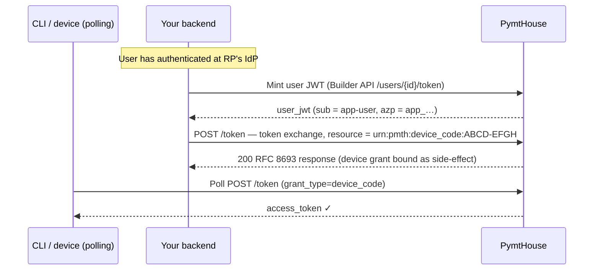

PymtHouse implements the **OAuth 2.0 Token Exchange** grant (RFC 8693) for three server-side operations:

1. **Device completion** — a backend binds a pending RFC 8628 device grant to an authenticated user, completing the CLI authentication flow without a second browser redirect.
2. **Remote signer session exchange** — a short-lived access token is exchanged for a long-lived opaque remote signer session token (`pmth_*`) scoped to `sign:job`.
3. **Clearinghouse signer mint (Option A)** — M2M client credentials with `sign:mint_user_token` scope mints a user-scoped signer JWT and allowance data in a single call without a prior Builder API user-token step.

Operations 1 and 2 use the same token endpoint (`POST {issuer}/token`) and the same `grant_type`, but with different `resource` values. Operation 3 uses `client_credentials` grant type.

## Common parameters (operations 1 & 2)

All RFC 8693 token exchange requests:

| Parameter | Value |
| --- | --- |
| `grant_type` | `urn:ietf:params:oauth:grant-type:token-exchange` |
| `subject_token_type` | `urn:ietf:params:oauth:token-type:access_token` |
| `subject_token` | A valid access token issued by this PymtHouse issuer |

Authentication: **M2M HTTP Basic auth** (`Authorization: Basic base64(m2m_id:m2m_secret)`) is required for all token exchange calls.

---

## Device completion (RFC 8693 + RFC 8628)

Use this operation in the **NaaP / Option B** flow: after the user authenticates at your backend, call the token endpoint to bind the pending device grant. The polling CLI receives its access token on the next poll.

### Prerequisites

- A confidential M2M client (`m2m_…`) with `device:approve` **or** `users:token` scope.
- `device_third_party_initiate_login` enabled on the **public** client.
- A user-scoped JWT for the **public** `app_…` client (minted via [User tokens](/integration/user-tokens)).

### Flow



### Request

```bash
ISSUER="${BASE_URL}/api/v1/oidc"
M2M_ID="m2m_yourClientId"
M2M_SECRET="pmth_cs_yourSecret"
USER_JWT="eyJ..."      # access_token from user-token mint, azp = public app_… client
USER_CODE="ABCD-EFGH"  # code the CLI received in step 1 of device flow

curl -sS \
  -u "${M2M_ID}:${M2M_SECRET}" \
  -H "Content-Type: application/x-www-form-urlencoded" \
  --data-urlencode "grant_type=urn:ietf:params:oauth:grant-type:token-exchange" \
  --data-urlencode "subject_token=${USER_JWT}" \
  --data-urlencode "subject_token_type=urn:ietf:params:oauth:token-type:access_token" \
  --data-urlencode "resource=urn:pmth:device_code:${USER_CODE}" \
  "${ISSUER}/token"
```

**`resource` format:** `urn:pmth:device_code:<user_code>` — use the `user_code` (e.g. `ABCD-EFGH`), not the `device_code`. PymtHouse normalizes the code before lookup.

### Subject token requirements

The `subject_token` must be:

- A valid JWT issued by **this** PymtHouse issuer (signature verified against `{issuer}/jwks`).
- Issued to the **public** `app_…` client for the same app (`client_id` or `azp` claim = public client id).
- Not expired.

The M2M client's `allowed_scopes` must include `device:approve` or `users:token`.

### Response

```json
{
  "access_token": "pmth_signer_session_...",
  "issued_token_type": "urn:ietf:params:oauth:token-type:access_token",
  "token_type": "Bearer",
  "expires_in": 86400
}
```

The binding of the device grant is a **side-effect** of this call. The CLI's next poll of the device code token endpoint will return the bound session.

SDK helper:

```ts
await client.approveDeviceLogin({
  externalUserId: "naap-user-123",
  userCode: "ABCD-EFGH",
  publicClientId: process.env.PYMTHOUSE_PUBLIC_CLIENT_ID,
});
```

---

## Signer session exchange

Use this operation to exchange a short-lived user access token for a long-lived opaque remote signer session token (`pmth_*`).

### Prerequisites

- **HTTP Basic auth** with the confidential **M2M** client (`m2m_…` and secret).
- The M2M client's `allowed_scopes` must include **`users:token`**.
- The `subject_token` must already contain **`sign:job`** scope.

### Subject token binding

The `subject_token` must be a JWT from this issuer whose `client_id` or `azp` is either:

- The **public** `app_…` client for the same developer app as the authenticating M2M client (typical after interactive login or Builder user-token mint), or
- The same **M2M** `client_id` as the request (legacy `client_credentials` access token used as `subject_token`).

### Request

```bash
ISSUER="${BASE_URL}/api/v1/oidc"
M2M_ID="m2m_yourClientId"
M2M_SECRET="pmth_cs_yourSecret"
ACCESS_TOKEN="eyJ..."  # user access token with sign:job scope (azp = public app_…)

curl -sS \
  -u "${M2M_ID}:${M2M_SECRET}" \
  -H "Content-Type: application/x-www-form-urlencoded" \
  --data-urlencode "grant_type=urn:ietf:params:oauth:grant-type:token-exchange" \
  --data-urlencode "subject_token=${ACCESS_TOKEN}" \
  --data-urlencode "subject_token_type=urn:ietf:params:oauth:token-type:access_token" \
  --data-urlencode "scope=sign:job" \
  "${ISSUER}/token"
```

Omit `resource`, or set `resource` to the issuer URL (`{issuer}`) if your client always sends a resource indicator (RFC 8707).

### Response

```json
{
  "access_token": "pmth_signer_session_longtoken...",
  "issued_token_type": "urn:ietf:params:oauth:token-type:access_token",
  "token_type": "Bearer",
  "expires_in": 86400
}
```

SDK helpers:

```ts
// Exchange a user JWT for a signer session
const session = await client.exchangeForSignerSession({ userJwt: accessToken });

// Mint user JWT + exchange in one call
const session = await client.mintUserSignerSessionToken({
  externalUserId: "naap-user-123",
  scope: "sign:job",
});

// Full workflow: upsert user + mint + exchange
const session = await client.mintSignerSessionForExternalUser({
  externalUserId: "naap-user-123",
  email: "user@example.com",
});
// session.accessToken is opaque pmth_…
```

---

## Clearinghouse signer mint (Option A)

M2M clients with `sign:mint_user_token` scope (automatically added when the public client has `sign:job`) can mint a user-scoped signer JWT and receive allowance balance information in a single `client_credentials` call. This avoids the separate Builder API user-token step.

### Request

```bash
ISSUER="${BASE_URL}/api/v1/oidc"
M2M_ID="m2m_yourClientId"
M2M_SECRET="pmth_cs_yourSecret"

curl -sS \
  -H "Content-Type: application/x-www-form-urlencoded" \
  --data-urlencode "grant_type=client_credentials" \
  --data-urlencode "client_id=${M2M_ID}" \
  --data-urlencode "client_secret=${M2M_SECRET}" \
  --data-urlencode "scope=sign:mint_user_token" \
  --data-urlencode "external_user_id=naap-user-123" \
  --data-urlencode "audience=livepeer-remote-signer" \
  "${ISSUER}/token"
```

### Response

```json
{
  "access_token": "eyJ...",
  "token_type": "Bearer",
  "expires_in": 300,
  "scope": "sign:job",
  "balanceUsdMicros": "4200000",
  "lifetimeGrantedUsdMicros": "5000000"
}
```

| Field | Description |
| --- | --- |
| `access_token` | User-scoped JWT with `aud=livepeer-remote-signer`. Use as a Bearer token at the remote signer DMZ. |
| `balanceUsdMicros` | Current OpenMeter entitlement balance for the user in USD micros. |
| `lifetimeGrantedUsdMicros` | Total lifetime granted allowance for the user. |

<Note>
  `sign:mint_user_token` is automatically granted to M2M clients when the public sibling client has `sign:job` in its `allowed_scopes`. No manual scope configuration is required.
</Note>

---

## Error responses

| Status | Condition |
| --- | --- |
| `400 invalid_grant` | `subject_token` is expired, invalid signature, or wrong issuer. |
| `400 invalid_request` | Missing required parameter, or `resource` value not recognized. |
| `401 Unauthorized` | M2M / client credentials invalid. |
| `403 Forbidden` | M2M client lacks the required scope (`device:approve`, `users:token`, or `sign:mint_user_token`), or `subject_token` client mismatch. |

---

## Key design decisions

1. **Single token endpoint for all exchange types.** Routing device completion, signer session exchange, and signer JWT mint through `POST {issuer}/token` keeps the public surface minimal and consistent with RFC standards.
2. **`resource` as the dispatch discriminator.** `urn:pmth:device_code:<user_code>` signals device completion; absence or the issuer URL routes to signer session exchange.
3. **Binding is a side-effect, not the primary response.** The CLI polls the standard device code endpoint rather than a proprietary callback, keeping device polling logic independent of the Option B backend.
4. **Option A (`sign:mint_user_token`)** minimizes round trips for clearinghouse integrators — one call returns both the signer JWT and the user's current balance.

## Implementation tasks

- For device completion: mint the user JWT via the Builder API **before** calling the token exchange.
- Validate that your backend stores the `user_code` from the device code response and passes it verbatim to the `resource` parameter.
- For signer session exchange, verify the `subject_token` contains `sign:job` before calling.
- For Option A: ensure the M2M client has `sign:mint_user_token` in `allowed_scopes` (automatically derived from public client's `sign:job`).
- Check `balanceUsdMicros` from the Option A response to gate access before forwarding to the DMZ.
- Do not retry a device completion exchange with the same `user_code` after success; the grant has already been bound.
- After obtaining a signer session or signer JWT, forward it to the remote signer DMZ — see [Signer routing](/integration/signer-routing).
