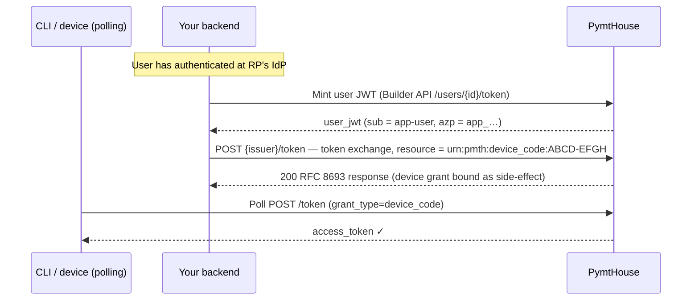

PymtHouse implements **OAuth 2.0 Token Exchange** (RFC 8693) for three server-side operations. They use **different endpoints**:

1. **Device completion** — bind a pending RFC 8628 device grant to an authenticated user via `POST {issuer}/token`.
2. **Signer session exchange** — exchange a user JWT **or** per-user API key for a clearinghouse-compatible **`SignerSession`** via `POST /api/v1/apps/{clientId}/oidc/token`.
3. **Clearinghouse signer mint (Option A)** — M2M `client_credentials` with `sign:mint_user_token` on `POST /api/v1/oidc/token` mints a user-scoped signer JWT and allowance data in one call.

The global OIDC token endpoint (`POST /api/v1/oidc/token` or `{issuer}/token`) covers standard OAuth grants and device completion. **API-key and user-JWT SignerSession exchange** use the **app-scoped** route, not the global token endpoint.

---

## Device completion (RFC 8693 + RFC 8628)

Use this in the **NaaP / Option B** flow: after the user authenticates at your backend, call the **global** issuer token endpoint to bind the pending device grant. The polling CLI receives its access token on the next poll.

### Prerequisites

- A confidential M2M client (`m2m_…`) with `device:approve` **or** `users:token` scope.
- `device_third_party_initiate_login` enabled on the **public** client where required.
- A user-scoped JWT for the **public** `app_…` client (minted via [User tokens](/integration/user-tokens)).

### Flow


```mermaid
sequenceDiagram
  participant Device as CLI / device (polling)
  participant RP as Your backend
  participant OP as PymtHouse

  Note over RP: User has authenticated at RP's IdP
  RP->>OP: Mint user JWT (Builder API /users/{id}/token)
  OP-->>RP: user_jwt (sub = app-user, azp = app_…)
  RP->>OP: POST {issuer}/token — token exchange, resource = urn:pmth:device_code:ABCD-EFGH
  OP-->>RP: 200 RFC 8693 response (device grant bound as side-effect)
  Device->>OP: Poll POST /token (grant_type=device_code)
  OP-->>Device: access_token ✓
```

### Request

HTTP Basic with the M2M client is **required** for device completion.

```bash
ISSUER="${BASE_URL}/api/v1/oidc"
M2M_ID="m2m_yourClientId"
M2M_SECRET="pmth_cs_yourSecret"
USER_JWT="eyJ..."      # access_token from user-token mint, azp = public app_… client
USER_CODE="ABCD-EFGH"  # code the CLI received in step 1 of device flow

curl -sS \
  -u "${M2M_ID}:${M2M_SECRET}" \
  -H "Content-Type: application/x-www-form-urlencoded" \
  --data-urlencode "grant_type=urn:ietf:params:oauth:grant-type:token-exchange" \
  --data-urlencode "subject_token=${USER_JWT}" \
  --data-urlencode "subject_token_type=urn:ietf:params:oauth:token-type:access_token" \
  --data-urlencode "resource=urn:pmth:device_code:${USER_CODE}" \
  "${ISSUER}/token"
```

**`resource` format:** `urn:pmth:device_code:<user_code>` — use the `user_code` (e.g. `ABCD-EFGH`), not the `device_code`.

### Subject token requirements

The `subject_token` must be:

- A valid JWT issued by **this** PymtHouse issuer (signature verified against `{issuer}/jwks`).
- Issued to the **public** `app_…` client for the same app (`client_id` or `azp` = public client id).
- Not expired.

### Response

```json
{
  "access_token": "…",
  "issued_token_type": "urn:ietf:params:oauth:token-type:access_token",
  "token_type": "Bearer",
  "expires_in": 86400
}
```

The binding of the device grant is a **side-effect** of this call. The CLI's next poll returns the bound session.

SDK helper:

```ts
await client.approveDeviceLogin({
  externalUserId: "naap-user-123",
  userCode: "ABCD-EFGH",
  publicClientId: process.env.PYMTHOUSE_PUBLIC_CLIENT_ID,
});
```

---

## Signer session exchange (app-scoped)

Clearinghouse-compatible **`SignerSession`** issuance:

```http
POST /api/v1/apps/{clientId}/oidc/token
Content-Type: application/x-www-form-urlencoded
```

| Field | Value |
| --- | --- |
| `grant_type` | `urn:ietf:params:oauth:grant-type:token-exchange` |
| `subject_token` | User access JWT **or** per-app-user API key (`pmth_*` / `app_….pmth_*`) |
| `subject_token_type` | `urn:ietf:params:oauth:token-type:access_token` |
| `audience` / `resource` | Optional; when provided must match configured signer audience (issuer URL, `SIGNER_TOKEN_AUDIENCE`, or legacy `livepeer-clearinghouse` / `livepeer-remote-signer`) |

Optional HTTP Basic with the M2M client. When omitted, the `subject_token` alone authenticates the exchange.

Do **not** use the global `{issuer}/token` endpoint for API-key SignerSession exchange. Do **not** call the removed `POST .../auth/api-key/signer-session` route.

### Example (API key as `subject_token`)

```bash
CLIENT_ID="app_yourClientId"
API_KEY="pmth_..."

curl -sS \
  -H "Content-Type: application/x-www-form-urlencoded" \
  --data-urlencode "grant_type=urn:ietf:params:oauth:grant-type:token-exchange" \
  --data-urlencode "subject_token=${API_KEY}" \
  --data-urlencode "subject_token_type=urn:ietf:params:oauth:token-type:access_token" \
  "${BASE_URL}/api/v1/apps/${CLIENT_ID}/oidc/token"
```

### Example (user JWT after device flow or M2M user-token mint)

```bash
USER_JWT="eyJ..."

curl -sS \
  -H "Content-Type: application/x-www-form-urlencoded" \
  --data-urlencode "grant_type=urn:ietf:params:oauth:grant-type:token-exchange" \
  --data-urlencode "subject_token=${USER_JWT}" \
  --data-urlencode "subject_token_type=urn:ietf:params:oauth:token-type:access_token" \
  "${BASE_URL}/api/v1/apps/${CLIENT_ID}/oidc/token"
```

### Response (`SignerSession`)

```json
{
  "access_token": "eyJ...",
  "token_type": "Bearer",
  "expires_in": 300,
  "scope": "sign:job",
  "signer_url": "https://dmz.example.com",
  "discovery_url": "https://discovery.livepeer.cloud",
  "issued_token_type": "urn:ietf:params:oauth:token-type:access_token",
  "correlation_id": "…",
  "balanceUsdMicros": "4200000",
  "lifetimeGrantedUsdMicros": "5000000"
}
```

| Field | Description |
| --- | --- |
| `access_token` | Short-lived signer JWT for the remote DMZ. |
| `signer_url` | Optional remote signer DMZ URL. |
| `discovery_url` | Optional Livepeer network discovery URL (not OIDC metadata). |
| `issued_token_type` | RFC 8693 issued token type when present. |
| `correlation_id` | Optional request correlation id. |
| `balanceUsdMicros` | Current OpenMeter entitlement balance (USD micros). |
| `lifetimeGrantedUsdMicros` | Lifetime granted allowance (USD micros). |

SDK helpers (paths may vary by SDK version — prefer the HTTP contract above):

```ts
const session = await client.exchangeForSignerSession({ userJwt: accessToken });

const session = await client.mintUserSignerSessionToken({
  externalUserId: "naap-user-123",
  scope: "sign:job",
});

const session = await client.mintSignerSessionForExternalUser({
  externalUserId: "naap-user-123",
  email: "user@example.com",
});
```

---

## Clearinghouse signer mint (Option A)

M2M clients with `sign:mint_user_token` (auto-added when the public client has `sign:job`) can mint a user-scoped signer JWT and receive allowance balance in a single `client_credentials` call on the **global** OIDC token endpoint.

### Request

```bash
ISSUER="${BASE_URL}/api/v1/oidc"
M2M_ID="m2m_yourClientId"
M2M_SECRET="pmth_cs_yourSecret"

curl -sS \
  -H "Content-Type: application/x-www-form-urlencoded" \
  --data-urlencode "grant_type=client_credentials" \
  --data-urlencode "client_id=${M2M_ID}" \
  --data-urlencode "client_secret=${M2M_SECRET}" \
  --data-urlencode "scope=sign:mint_user_token" \
  --data-urlencode "external_user_id=naap-user-123" \
  "${ISSUER}/token"
```

### Response

```json
{
  "access_token": "eyJ...",
  "token_type": "Bearer",
  "expires_in": 300,
  "scope": "sign:job",
  "balanceUsdMicros": "4200000",
  "lifetimeGrantedUsdMicros": "5000000"
}
```

| Field | Description |
| --- | --- |
| `access_token` | Short-lived signer JWT. Use as a Bearer token at the remote signer DMZ. |
| `balanceUsdMicros` | Current OpenMeter entitlement balance for the user in USD micros. |
| `lifetimeGrantedUsdMicros` | Total lifetime granted allowance for the user. |

For a follow-on RFC 8693 exchange after minting a **user** JWT (not Option A), use `POST /api/v1/apps/{clientId}/oidc/token`.

<Note>
  `sign:mint_user_token` is automatically granted to M2M clients when the public sibling client has `sign:job` in its `allowed_scopes`.
</Note>

---

## Error responses

| Status | Condition |
| --- | --- |
| `400 invalid_grant` | `subject_token` is expired, invalid signature, wrong issuer, or invalid API key. |
| `400 invalid_request` | Missing required parameter, or `resource` / `audience` not recognized. |
| `401 Unauthorized` | M2M credentials invalid (when Basic is required or supplied). |
| `403 Forbidden` | M2M client lacks the required scope, or `subject_token` client mismatch. |

---

## Key design decisions

1. **App-scoped route for SignerSession.** Clearinghouse-compatible exchange (JWT or API key) uses `POST /api/v1/apps/{clientId}/oidc/token` so `{clientId}` is explicit and Basic auth can be optional when the API key authenticates the call.
2. **Global issuer token endpoint for device completion and Option A.** Device binding and `sign:mint_user_token` stay on `{issuer}/token` / `/api/v1/oidc/token`.
3. **Binding is a side-effect for device completion.** The CLI polls the standard device code endpoint rather than a proprietary callback.
4. **Option A minimizes round trips** for clearinghouse integrators — one call returns the signer JWT and the user's current balance.

## Implementation tasks

- For device completion: mint the user JWT via the Builder API **before** calling `{issuer}/token`.
- For SignerSession: call `POST /api/v1/apps/{clientId}/oidc/token` (not the global token endpoint, and not the removed `auth/api-key/*` routes).
- Never pass `pmth_cs_*` as `subject_token`.
- For Option A: rely on auto-derived `sign:mint_user_token` when the public client has `sign:job`.
- After obtaining a signer session or signer JWT, forward it to the remote signer DMZ — see [Signer routing](/integration/signer-routing).
