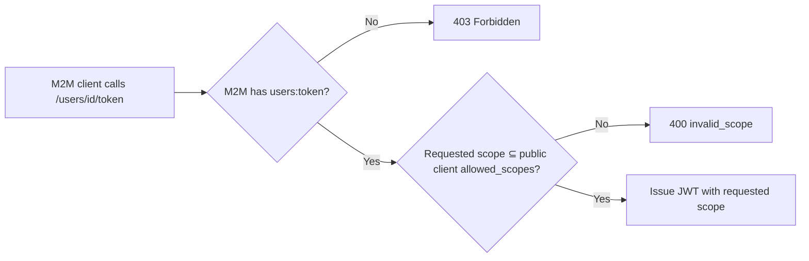

The user-token endpoint lets your backend issue a short-lived JWT on behalf of a provisioned end-user. These tokens carry the user's identity as their `sub` and are scoped to a specific capability (e.g. `sign:job`). Downstream PymtHouse services validate this token before processing any user request.

## When to mint user tokens

Mint a user-scoped JWT when:

- Your backend needs to authorize an end-user for a PymtHouse service on their behalf.
- You are completing a device flow (RFC 8628) and need a `subject_token` for the RFC 8693 exchange.
- You want to pass a short-lived, user-attributable credential to your frontend or CLI rather than a long-lived secret.

## Prerequisites

- The user must already be provisioned in PymtHouse. See [User management](/integration/user-management).
- Your M2M client (`m2m_…`) must have `users:token` scope.
- The requested scope must be listed in the **public** client's `allowed_scopes` — not the M2M client's. For example, to request `sign:job`, the public `app_…` client must have `sign:job` in its `allowed_scopes`.

```bash
export BASE_URL="https://your-pymthouse.example"
export CLIENT_ID="app_yourClientId"       # public client id
export M2M_ID="m2m_yourClientId"
export M2M_SECRET="pmth_cs_yourSecret"
```

## Endpoint

```http
POST /api/v1/apps/{clientId}/users/{externalUserId}/token
Authorization: Basic base64(m2m_id:m2m_secret)
Content-Type: application/json
```

`{clientId}` is the **public** `app_…` client id. `{externalUserId}` is your system's user identifier as stored during provisioning.

## Request body

```json
{ "scope": "sign:job" }
```

| Field | Type | Required | Description |
| --- | --- | --- | --- |
| `scope` | string | No | Space-separated list of scopes to include in the issued JWT. Defaults to `sign:job` if omitted. Must be a subset of the public client's `allowed_scopes`. |

<Note>
  `admin` is explicitly rejected regardless of scope configuration. User tokens can never escalate to administrative privilege.
</Note>

## Example

```bash
USER_JWT=$(curl -sS \
  -u "${M2M_ID}:${M2M_SECRET}" \
  -H "Content-Type: application/json" \
  -d '{ "scope": "sign:job" }' \
  "${BASE_URL}/api/v1/apps/${CLIENT_ID}/users/user-123/token" \
  | jq -r '.access_token')

echo "User JWT: ${USER_JWT:0:60}..."
```

**Response:**

```json
{
  "access_token": "eyJhbGciOiJSUzI1NiIsInR5cCI6IkpXVCJ9...",
  "token_type": "Bearer",
  "expires_in": 300
}
```

## JWT claims

The issued JWT contains:

| Claim | Value | Notes |
| --- | --- | --- |
| `iss` | PymtHouse issuer URL | Verify against discovery. |
| `sub` | `app_users.id` (PymtHouse app-user row id) | Not the same as `externalUserId`. |
| `client_id` / `azp` | Public `app_…` client id | Used for tenant matching in RFC 8693 exchanges. |
| `external_user_id` | Your system's user identifier | The `externalUserId` as stored during provisioning. Included on programmatic user JWTs for downstream attribution without requiring a separate lookup. |
| `scope` | Granted scopes | Subset of the public client's `allowed_scopes`. |
| `exp` | Expiry timestamp | Tokens are short-lived by design. |

<Warning>
  `sub` is the PymtHouse internal app-user id, **not** your `externalUserId`. Prefer the `external_user_id` claim for correlating the JWT back to your user, rather than parsing `sub`.
</Warning>

## Passing the token to downstream services

Pass the JWT in a standard `Authorization: Bearer` header to any PymtHouse service that validates it:

```bash
curl -sS \
  -H "Authorization: Bearer ${USER_JWT}" \
  "https://your-signer.example/sign"
```

The receiving service verifies the JWT signature against `{issuer}/jwks`, checks `exp`, and validates `scope` includes the required capability before processing.

## Scope validation flow



The requested scope is validated against the **public** client's `allowed_scopes`, not the M2M client's. This means the M2M client cannot grant a user more capability than the public client's registration allows, regardless of what scopes the M2M client itself holds.

## Token lifetime and refresh

User-scoped JWTs are intentionally short-lived (seconds to minutes). There is no refresh token for programmatic user JWTs — your backend simply mints a new one when needed. This design:

- Limits the blast radius of a leaked user token.
- Keeps revocation implicit (expiry) rather than requiring an explicit revocation endpoint.
- Ensures the scope remains correct even if the public client's `allowed_scopes` changes.

## Device flow integration

When completing an RFC 8628 device grant via RFC 8693 token exchange, the user JWT you mint here becomes the `subject_token`:

```bash
# 1. Mint user JWT
USER_JWT=$(curl -sS \
  -u "${M2M_ID}:${M2M_SECRET}" \
  -H "Content-Type: application/json" \
  -d '{ "scope": "sign:job" }' \
  "${BASE_URL}/api/v1/apps/${CLIENT_ID}/users/user-123/token" \
  | jq -r '.access_token')

# 2. Bind device grant
curl -sS \
  -u "${M2M_ID}:${M2M_SECRET}" \
  -H "Content-Type: application/x-www-form-urlencoded" \
  --data-urlencode "grant_type=urn:ietf:params:oauth:grant-type:token-exchange" \
  --data-urlencode "subject_token=${USER_JWT}" \
  --data-urlencode "subject_token_type=urn:ietf:params:oauth:token-type:access_token" \
  --data-urlencode "resource=urn:pmth:device_code:ABCD-EFGH" \
  "${BASE_URL}/api/v1/oidc/token"
```

For the full end-to-end flow, see [Token exchange — device completion](/integration/token-exchange#device-completion).

## Error responses

| Status | Condition |
| --- | --- |
| `400 Bad Request` | Requested scope includes `admin`, or scope is not a subset of the public client's `allowed_scopes`. |
| `401 Unauthorized` | Invalid M2M credentials or expired Bearer token. |
| `403 Forbidden` | M2M client lacks `users:token`. |
| `404 Not Found` | `clientId` path does not match the M2M client's app, or `externalUserId` has not been provisioned. |

## Key design decisions

1. **Scope validation against the public client, not the M2M client.** The public `app_…` client represents the app's registration contract with the platform — what capabilities it is permitted to grant users. The M2M client is an operational credential. Validating the requested scope against the public client ensures users cannot receive capabilities that exceed the app's registration, even if the M2M client holds broader scopes.
2. **No `admin` scope in user tokens.** The user-token path is explicitly designed for end-user contexts. Administrative privilege cannot be embedded in a token that is intended to be passed to the user session or a client SDK. This is enforced at the route level, not as a policy check.
3. **`sub` is the app-user row id.** Using the PymtHouse internal `app_users.id` as `sub` makes the token's subject stable under email or `externalUserId` changes, and avoids leaking the integrator's internal user identifier in a standard JWT claim that may be logged or decoded by third-party services.
4. **Short lifetime, no refresh.** User JWTs are issued on demand by a backend that already holds the M2M credential. Making them short-lived with no refresh means the blast radius of a leaked token is bounded to its TTL. Re-minting is a single backend API call rather than a stateful refresh flow.

## Implementation tasks

- Provision the user with the Builder API before calling this endpoint. A `404` on the user-token path most commonly means the `externalUserId` was never provisioned, not that the credentials are wrong.
- Verify the requested scope is listed in the public client's `allowed_scopes` before calling — you will get a `400` otherwise, and surfacing that at call time makes debugging easier.
- Do not store user JWTs beyond the scope of a single request chain. Mint fresh tokens for each user session or device flow.
- In your JWT verification logic for downstream services, check `client_id` or `azp` against the known public `app_…` client id to confirm the token was issued for your app before trusting the `scope` claim.
